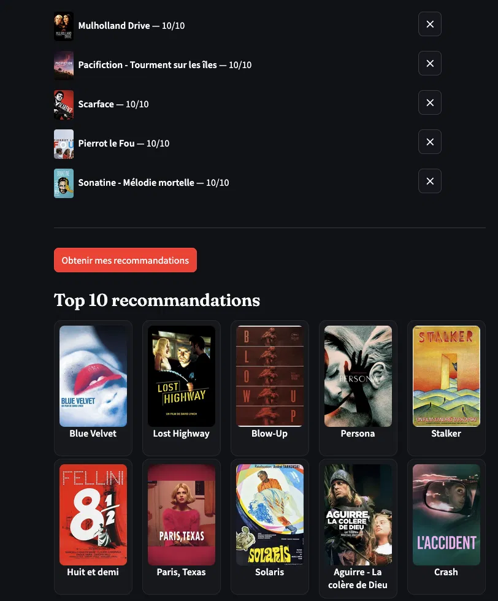

# SensCritique Recommender

A collaborative filtering movie recommendation system built on data scraped from [SensCritique](https://www.senscritique.com/), a French cultural review platform.

> **🎬 Live demo:** try the model in your browser → [**MovieRecommender on HuggingFace Spaces**](https://huggingface.co/spaces/AlexandreIrazoqui/MovieRecommender)
> Paste a Letterboxd/Senscritique export (or rate a few films by hand) and get personalized recommendations.
> 
> The full approach behind each stage : scraping strategy, filtering thresholds, model selection, IPS tuning, and evaluation protocol is documented in [**Rendu.pdf**](Rendu.pdf).

<p align="center">
  
</p>

---

## Overview

This project builds a **user × film rating matrix** from ~46M SensCritique ratings, then trains a collaborative filtering model to find correlations between users' tastes and generate personalized movie recommendations.

The pipeline has four stages:
1. **Scraping** - collecting ratings via the SensCritique GraphQL API
2. **Exploration & Preprocessing** - cleaning and filtering the dataset (see the notebook)
3. **Modeling** - matrix factorization (ALS from scratch) with popularity-debiasing (IPS)
4. **Recommendation** - interactive CLI + deployed web app

---

## Dataset

### Film selection

The ~5,300 films in the dataset were sourced from the collection of **Moizi**, a well-known cinephile user on SensCritique.

This choice was intentional. Common alternatives - scraping from "Top Films" rankings or genre lists - introduce significant biases:
- They over-represent critically acclaimed or popular films
- They systematically exclude niche, older, or less-rated films
- The resulting rating matrix reflects taste for *good* films, not taste in general

Using a single cinephile's broad and eclectic collection gives a more **diverse and representative** film corpus while remaining manageable in size.

### Scale

After scraping ratings for all films in that collection:

| Metric | Value |
|---|---|
| Raw ratings | ~47.5 million |
| Unique users | ~582,000 |
| Unique films | ~5,336 |
| Raw sparsity | ~98.5% |

After filtering (users with ≥ 20 ratings, films with ≥ 50 ratings, and removing the seed user):

| Metric | Value |
|---|---|
| Filtered ratings | ~46 million |
| Unique users | ~207,000 |
| Unique films | ~5,086 |
| Filtered sparsity | ~92.5% |

The threshold of **20 minimum ratings per user** was chosen because it removes a large portion of sparse/inactive users (56% of users) while retaining 96.8% of all ratings - a good trade-off.

---

## Model

The recommender is a **matrix factorization** model trained with **Alternating Least Squares (ALS)**, implemented from scratch in NumPy (`models/ALS.py`).

### ALS from scratch

- Closed-form ALS updates alternating user factors `P` and item factors `Q`.
- **Iterative biases** (global mean `μ`, user bias `bᵤ`, item bias `bᵢ`) , with a separable bias regularization (`reg_bias`).


### Popularity debiasing (IPS)

Rating data is heavily skewed toward popular films, so a naive model just re-recommends blockbusters. To counter this, the loss is reweighted with **Inverse Propensity Scoring (IPS)**: each item's contribution is scaled by `(1 / pᵢ)^α`, where `pᵢ` is the item's observation propensity (popularity). The `ips_alpha` exponent tempers extreme weights.

### Benchmarks

Evaluated with `models/bench_als.py` (single ALS config) and `models/bench_ips.py` (ALS vs ALS + IPS).

**Rating prediction** - held-out test split, 1–10 scale:

| Metric | Value |
|---|---|
| Train RMSE | 1.14 |
| Test RMSE | 1.24 |

**Ranking** - rank a held-out positive film against sampled negatives:

| Protocol | Metric | Value |
|---|---|---|
| A - test positives + 100 negatives | NDCG@10 | 0.42 |
| A - test positives + 100 negatives | MAP@10 (rating ≥ 7) | 0.31 |
| B - 1 positive + 99 negatives (NeuMF leave-one-out) | HR@10 | 0.55 |
| B - 1 positive + 99 negatives (NeuMF leave-one-out) | NDCG@10 | 0.36 |

With one positive among 100 candidates, a random ranker scores HR@10 ≈ 0.10. The model's **0.55** shows it captures real taste signal rather than just popularity.


---

## Recommendation

`recommend.py` is an interactive CLI that loads the trained model and serves top-10 recommendations for a **new user** via ALS fold-in (a cold-start user is folded into the latent space from their own ratings; the IPS weights are *not* applied to a single user's individual ratings). Two modes:

1. **Manual** - type a film title + a rating /10, repeat, get recommendations.
2. **CSV import** - drop a [Letterboxd](https://letterboxd.com/) export (`Title, Year, Directors, Rating10, WatchedDate`); titles are matched to SensCritique IDs via `data/processed/title_mapping.csv`.

Below `COLD_START_THRESHOLD` ratings, a weighted cosine-to-centroid scoring is used (the IPS-trained model lacks signal for an ALS fold-in on very few ratings); above it, a classic ALS fold-in.


---

## Ethical considerations

- All data scraped is **publicly visible** on SensCritique without authentication (ratings are public by default).
- **robots.txt compliance.** SensCritique's `robots.txt` (accessible at `https://www.senscritique.com/robots.txt`) does not restrict general-purpose crawlers from accessing the pages targeted by this scraper.
- No personal data beyond anonymized user IDs and numerical ratings is collected or stored.
- The scraper uses **rate limiting** (configurable delays between requests) to avoid overloading the platform's servers.
- I reached out to SensCritique by email to ask for explicit permission to use their data for this non-commercial research project. I did not receive a response.
- Data is not redistributed, only the scraping and modeling code is shared.

---

## Setup

### Requirements

Requires **Python 3.12** 

```bash
python3.12 -m venv .venv
.venv/bin/pip install requests python-dotenv pandas "numpy<2" scipy scikit-learn scikit-surprise threadpoolctl
```

### Authentication token

The SensCritique API requires a bearer token. To get yours:

1. Log in to [senscritique.com](https://www.senscritique.com) in your browser
2. Open DevTools → Network tab
3. Trigger any page load and find a request to `https://apollo.senscritique.com/`
4. In the request headers, copy the value of the `authorization` field

Then create a `.env` file at the root of the project:

```
SC_TOKEN=Bearer <your_token_here>
```

> /!\ Tokens expire. If the scraper suddenly returns 0 ratings for 10 consecutive films, your token has likely expired - refresh it using the steps above.

---

## Running the scraper

### Step 1 - Collect film IDs

```bash
python scraper/collection.py
```

This fetches all film IDs from the target user's collection and saves them to `data/raw/film_ids.json`.

### Step 2 - Scrape ratings

```bash
python scraper/scrape_all.py
```

This iterates over all film IDs and scrapes ratings from the GraphQL API. Ratings are appended to `data/raw/all_ratings.csv`, and progress is tracked in `data/raw/done_ids.json`, so the scraper can be **safely interrupted and resumed**.

---

## Exploration & preprocessing

All data exploration, filtering decisions, and sparse matrix construction are documented in:

```
notebook/Films.ipynb
```

It covers:
- Rating distribution
- Notes per user / per film (with log-scale histograms)
- Sparsity analysis
- Threshold selection for filtering
- Construction of the `scipy.sparse` CSR matrix used as model input

Then run the preprocessing pipeline (filter, encode, build sparse matrix):

```bash
.venv/bin/python prepare_data.py
```

---

## Training & evaluating the model

```bash
# Sanity-check SVD on a 500K sample (SGD baseline)
.venv/bin/python -m models.svd_sanity_check

# Benchmark a single ALS configuration (RMSE + ranking)
.venv/bin/python -m models.bench_als

# Compare ALS baseline vs ALS + IPS popularity debiasing
.venv/bin/python -m models.bench_ips

# Get recommendations (manual input or Letterboxd CSV)
.venv/bin/python recommend.py
```

---


